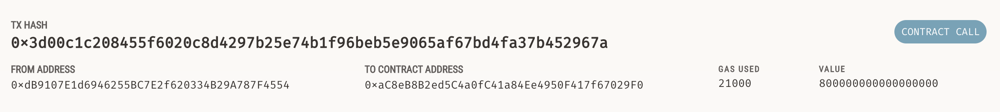
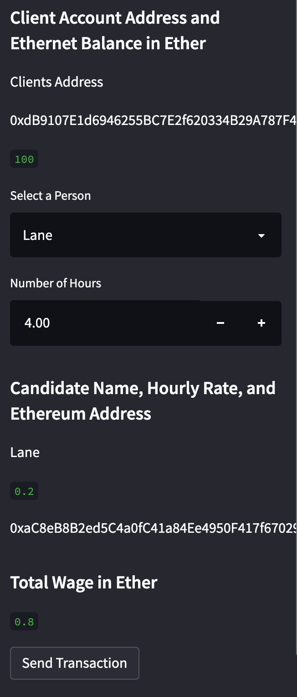

# Fintech_Finder
A streamlit application to find, hire, and send funds to workers with Ether on a testnet. 

## Technologies

This project leverages python3 with the following packages:

* [dotenv](https://www.npmjs.com/package/dotenv) - For accessing hidden .env file.

* [streamlit](https://docs.streamlit.io/library/get-started/installation) - For a blockchain interface. 

* [bip44](https://pypi.org/project/bip44/) - For simple Python bip44 implementation.

* [web3](https://pypi.org/project/web3/) - A Python library for interacting with Ethereum. 

* [dataclassses](https://pypi.org/project/dataclasses/) - For Python class data.  

* [typing](https://pypi.org/project/typing/) - Typing defines a standard notation for Python function and variable type annotations. 

---

## Installation Guide

pip install dotenv
pip install streamlit
pip install dataclasses
pip install web3
pip install typing
pip install bip44

---

## Usage

Install ganache, copy the generated mnemonic seed, hide it in an .env file, and save the file. CD to the correct directory and run 'streamlit run fintech_finder.py' from there find a candidate to pay, select the hours you want, pay the candidate, and view it was verified in ganache. 
---

## Images

# Viewing the sent transaction.

# Options within streamlit.

# Balance orignally 100 ETH has dropped after transaction was send.

---

## Contributors

Made by Owen Wardlaw : owardlaw@ucsd.edu.
---

## License

MIT
